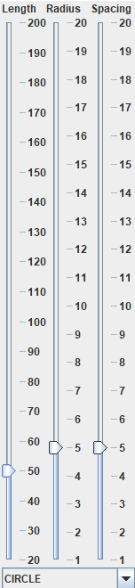
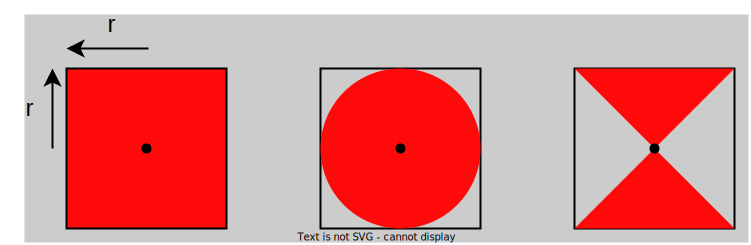

# Riadny termín OOP \[60b], 23.05.2023 11:00
B-OOP 2023

Vytvorte oknovú aplikáciu, ktorá umožní používateľovi kresliť farebnú reťaz s geometrickými tvarmi pomocou pohybu myši.
Aplikácia bude mať nasledovnú funkcionalitu (40 bodov):

1. Vytvorenie hlavného okna, ktoré bude obsahovať funkčné Ovládacie prvky a Kresliacu plochu \[9b].
2. Kreslenie čiary \[5b].
3. Kreslenie geometrických tvarov na čiare \[10b].
4. Vplyv ovládacích prvkov na vykresľovanie \[10b].
5. Vykresľovanie farebného gradientu \[5b].
6. Zatvorenie aplikácie cez tlačidlo na zatvorenie aplikácie poskytnuté operačným systémom \[1b].

## Podrobný popis k bodu 1:

Väčšinu plochy okna bude zaberať Kresliaca plocha. V bočnej časti okna (vľavo, alebo vpravo) sa budú nachádzať Ovládacie
prvky. Ovládacie prvky budú tvoriť:
1. [JSlider](https://docs.oracle.com/en/java/javase/11/docs/api/java.desktop/javax/swing/JSlider.html) s vertikálnym usporiadaním, rozsah 20-200, krok 10, počiatočná hodnota 50, na výber dĺžky reťaze
2. [JSlider](https://docs.oracle.com/en/java/javase/11/docs/api/java.desktop/javax/swing/JSlider.html) s vertikálnym usporiadaním, rozsah 1-20, krok 1, počiatočná hodnota 5, na výber polomeru kreslených tvarov
3. [JSlider](https://docs.oracle.com/en/java/javase/11/docs/api/java.desktop/javax/swing/JSlider.html) s vertikálnym usporiadaním, rozsah 1-20, krok 1, počiatočná hodnota 5, na výber odstupu medzi tvarmi
4. 3x [JLabel](https://docs.oracle.com/en/java/javase/11/docs/api/java.desktop/javax/swing/JLabel.html) popisujúci každý zo sliderov (umiestnený nad alebo pod sliderom ku ktorému prislúcha)
5. [JCombobox](https://docs.oracle.com/en/java/javase/11/docs/api/java.desktop/javax/swing/JComboBox.html) na výber kreslených tvarov na reťazi (kruh, štvorec, presípacie hodiny), počiatočná hodnota je kruh

Rozloženie ovládacích prvkov by malo byť približne ako na obrázku. Slideri snapujú na zvolený krok.

## Podrobný popis k bodu 2:

Keď sa pohne (alebo dragne) myš, tak sa jej aktuálna pozícia uloží na začiatok zoznamu súradníc.
Pokiaľ pridanie bodu predĺži zoznam na viac prvkov, ako je maximálna dĺžka reťaze, nadbytočné prvky z konca zoznamu budú odstránené.

Čiara sa vykresľuje medzi prvý a druhým, druhým a tretím, ..., pred-posledným a posledným bodom zoznamu.

Segmenty čiary (a tvary z bodu 3), ktoré sa nachádzajú bližšie ku začiatku zoznamu prekrývajú tie, ktoré sa nachádzajú neskôr v zozname.

## Podrobný popis k bodu 3:

Na bodoch z ktorých sa skladá reťaz sa vykresľujú zvolené tvary. Stred tvaru je bod reťaze a veľkosť tvaru je určená aktuálnou hodnotou polomeru.
Tvary sa nemusia vykresľovať v každom bode reťaze, to určuje aktuálne zvolený odstup.

Keď je odstup 1, tak sa vykresľujú v každom bode, keď 2 tak v každom druhom, atď.
Tvar sa vždy vykresľuje na prvom bode zoznamu (index 0 je deliteľný ľubovoľným číslom).
Tvar sa taktiež vždy vykresľuje na poslednom bode zoznamu, aj keby jeho index nebol deliteľný zvoleným odstupom.

## Podrobný popis k bodu 4:

Ovládacie prvky menia parametre vykreslovania a ich zmena sa okamžite prejaví na vykresľovacej ploche.
Počiatočné parametre vykresľovania sú totožné s počiatočnou hodnotou ovládacích prvkov.

Keď sa zväčší dĺžka reťaze tak sa do nej pridajú nové body postupne pri pohybe myši.
Keď sa tento počet zmenší, tak sú body z reťaze odstránené okamžite.

Keď sa zmení polomer, alebo odstup, tak sa automaticky prekreslia tvary (zmenia svoju veľkosť, resp. sa poposúvajú na nové pozície na reťazi).

Keď sa zmení aktuálne zvolený tvar, tak sa automaticky prekreslia všetky tvary na novo zvolený.

## Podrobný popis k bodu 5:

Segmenty reťaze a tvary na nej majú farbu podľa svojej pozície v reťazi.

Segmenty v reťazi spoločne tvoria nejaký lineárny farebný gradient, napríklad:

* prechod z červenej do čiernej
* prechod z modrej do žltej
* prechod po farbách dúhy v HSV farebnom priestore [Color.getHSBColor()](https://docs.oracle.com/en/java/javase/11/docs/api/java.desktop/java/awt/Color.html#getHSBColor(float,float,float))

Pri tvorbe gradientu nepoužívajte bielu farbu.

Gradient závisí od nastavenej maximálnej dĺžky reťaze, aby prvý prvok bol vždy na začiatku postupnosti farieb a posledný vždy na konci
(veľkosť kroku v priestore farieb sa mení podľa maximálnej dĺžky).

## Hodnotenie

Projekt obsahuje github pipeline, ktorá kontroluje skompilovateľnosť programu. **Pokiaľ program nie je skompilovateľný nebude hodnotený a skúška bude hodnotená 0b!**

**Pokiaľ budete počas skúšky pristihnutý pri podvádzaní, alebo bude váš kód vykazovať príliš veľkú podobnosť s kódom iných študentov, bude skúška hodnotená 0 bodmi!**

Okrem funkcionality budú hodnotené aj princípy Objektovo orientovaného programovania (20 bodov), budeme hodnotit približne rovnaké veci ako pri druhom zadaní, pre istotu uvádzame niektoré z nich:

* správne modifikátory prístupu,
* vhodné pomenovanie tried a metód,
* vhodné využitie dedenia a polymorfizmu
* vhodné použitie výnimiek na ošetrenie nedovoleného správania (nehádzať a nezachytávať všeobecnú triedu Exception),
* stavové premenné ako int alebo String,
* duplicitný kód,
* unused kód,
* nedodržanie konvencií,
* použitie keyStroke,
* použitie vnorených tried (nested class),
* použitie statických metód alebo nekonštantných statických premenných,
* celá aplikácia naprogramovaná v jednej triede,
* inicializacia atributov triedy pri ich vytvoreni,
* kontrola kláves bez java konštánt (VK_),
* vykreslovanie textu cez kresliacu plochu,
* keyListener prestane fungovať po stlačení niečoho v menu,
* Null layout

Za každy nedostatok vám možu byť strhnuté cca 3-4 body.

Pokiaľ vaše riešenie neobsahuje dostatok implementácie je maximálny počet bodov z OOP znížený priamo úmerne s množstvom implementácie, podľa názoru hodnotiaceho.

## Odovzdanie

Vypracovanie skúšky odovzdajte cez Github classroom vykonaním commit a push zdrojového kódu do vášho repozitára v skupine Interes-Group (tak ako na zadaniach). Hodnotí sa posledný pushnutý commit pred časom ukončenia skúšky (bude oznámený po začatí skúšky). Odovzdáva sa obsah celého projektu. Na vypracovanie písomky je vyhradený čas 3 hodiny.

---------------------------------------------------------------------------------------

# Exam RT OOP \[60b], 23.05.2023 11:00
B-OOP 2023

Your task is to create a java window application.
The application allows the user to draw a chain of lines and geometric shapes by moving the mouse.
The application has the following functionality (40 points):

1. Creation of the main window, that will contain control elements and a drawing area \[9b].
2. Drawing the lines of the chain \[5b].
3. Drawing the geometric shapes on the chain \[10b].
4. Influencing the drawn chain with the control elements \[10b].
4. Drawing a color gradient \[5pts].
5. Closing the application with the "close window" button provided by the operating system \[1pt].

## Description for bullet point 1:
Most of the window area will be covered by the drawing area.
The side of the window (left or right) will contain the control elements. The control elements consist of:
1. [JSlider](https://docs.oracle.com/en/java/javase/11/docs/api/java.desktop/javax/swing/JSlider.html) with vertical layout, range 20-200, step 10, initial value 50, for choosing the length of the chain
2. [JSlider](https://docs.oracle.com/en/java/javase/11/docs/api/java.desktop/javax/swing/JSlider.html) with vertical layout, range 1-20, step 1, initial value 5, for choosing the radius of the geometric shapes
3. [JSlider](https://docs.oracle.com/en/java/javase/11/docs/api/java.desktop/javax/swing/JSlider.html) with vertical layout, range 1-20, step 1, initial value 5, for choosing the spacing of the geometric shapes
4. 3x [JLabel](https://docs.oracle.com/en/java/javase/11/docs/api/java.desktop/javax/swing/JLabel.html) labeling each of the sliders (placed above, or below the slider it labels)
5. [JCombobox](https://docs.oracle.com/en/java/javase/11/docs/api/java.desktop/javax/swing/JComboBox.html) for choosing the drawn geometric shape (circle, square, hourglass), initial value is cirlce

The elements should be layed out similarly to the picture. The sliders snap to the ticks of the specified step.

## Description for bullet point 2:

When the mouse is moved (or dragged), its current position will be saved in the front of a list of points.
If adding the new positions increases the size of the list beyond the maximal size of the chain, the superfluous elements will be removed from the end of the list.

A line is drawn between the first and second, the third and fourth, ... the one-before-last and the last element of the list.

Lines (and geometric shapes from bullet point 3) corresponding to elements closer to the start of the list are drawn above shapes corresponding to elements later in the list.

## Description for bullet point 3:

Geometric shapes are drawn at the points that make up the chain.
The center of the shape is the point on the chain and the size is determined by the selected radius.
Shapes must not necessarily be drawn at every point in the chain, that is determined by the selected spacing.

If the spacing is 1, then the shapes are drawn at every point. If the spacing is 2, then at every other point and so on.
A shape is always drawn at the first point in the chain (index 0 is divisible by any number).
A shape is always drawn at the last point in the chain, even if its index is not divisible by the current spacing.

## Description for bullet point 4:

The control elements change the settings for drawing the chain. When a control element value changes the drawn chain is affected immediately.
The initial values of the control elements correspond to the initial settings for drawing the chain.

When the length of the chain increases, new points are added only after moving the mouse.
When the length of the chain decreases, superfluous points are removed immediately.

When the radius or spacing of the geometric shapes changes, the shapes are immediately repainted (they change their size, or change their spacing on the chain respectively).

When the selected shape changes, all drawn geometric shapes are replaced with the new shape.

## Description for bullet point 5:

The line segments of the chain and the geometric shapes have a color based on their position in the chain.

The colors of the chain is a linear gradient of some kind. For example:

* transition from red to black
* transition from blue to yellow
* transition through the colors of the rainbow in the HSV color space [Color.getHSBColor()](https://docs.oracle.com/en/java/javase/11/docs/api/java.desktop/java/awt/Color.html#getHSBColor(float,float,float))

Don't use the color white as part of your gradient.

The gradient depends on the maximal length of the chain. The first element should correspond to the first color and the
last element should correspond to the second color of the gradient (the step-size in the color space depends on the maximal length of the chain).

## Grading

The project contains a github pipeline, that checks whether it can be compiled or not. **If the program cannot be compiled it will not be graded and 0 points will be received for the exam!**.

**If you are caught cheating during the exam, or if the source code handed in by you will have a suspicious amount of similarities with the code of other students 0 points will be received for the exam!**

Appart from the functionality, the principles of Object-Oriented Programming will be graded as well (20 pts), pay close attention especially to:

* correct access modifiers,
* appropriate naming of classes and methods,
* appropriate use of inheritance and polymorphism,
* appropriate use of exceptions for handling illegal behavior (do not throw or catch the generic Exception class),
* usage of int or String state variables,
* duplicate code,
* unused code,
* usage of the java language conventions,
* usage of keyStroke,
* usage of nested classes,
* usage of static methods or non-final static variables,
* the entire application being coded in one class,
* initialisation of class attributes at declaration,
* comparing key codes without the java constants (VK_),
* drawing text over the drawing area,
* keyListener stops working when a menu element is clicked,
* Null layout

For each mistake you may lose around 3-4 points.

If your solution does not contain enough implementation, the maximum points that you can obtain for OOP may be changed accordingly, at the discretion of the examiner.

## Handing in the assigment

Hand in the assignment into your Github classroom repository located under the Interes-Group for this exam. Hand in the entire project. You have 3 hours to complete the exam.